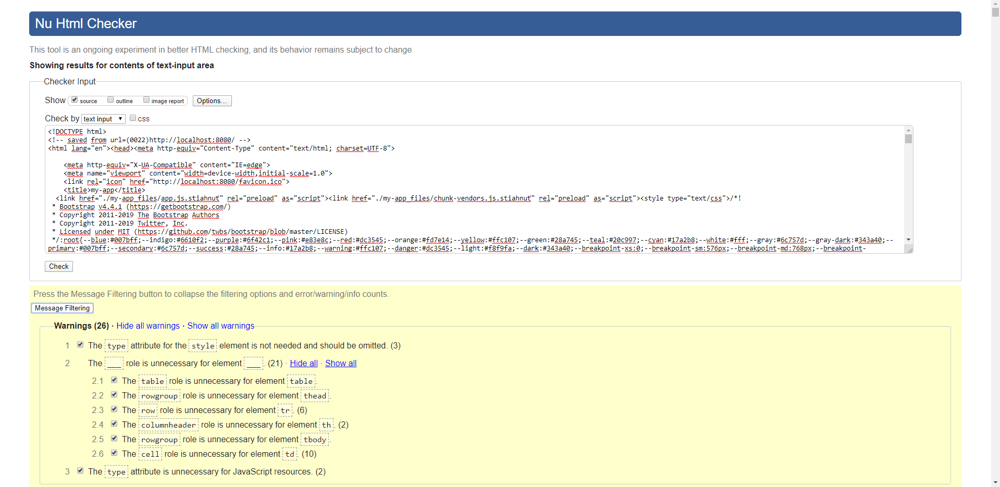
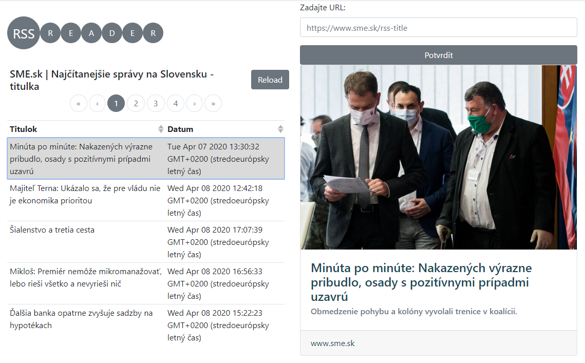

# RSS Reader

Vypracoval: Tomas Babjak

Vyvojove prostredie: Vue.js, Bootstrap-Vue

Projekt prezentovany 2.4.2020, splnene vsetky poziadavky okrem W3C Validatora

Dokaz o bezchybnom validovani zaslany na mail plus tu:



Screenshot RSS Reader:



Final HTML code of website:

[HTML code](my-app.html)

## Project setup
```
npm install
```

### Compiles and hot-reloads for development
```
npm run serve
```
